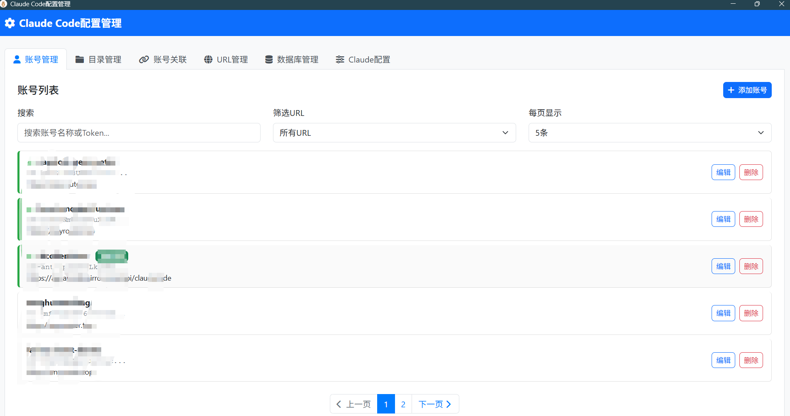
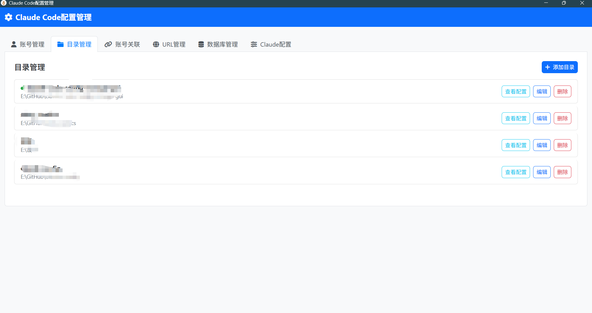
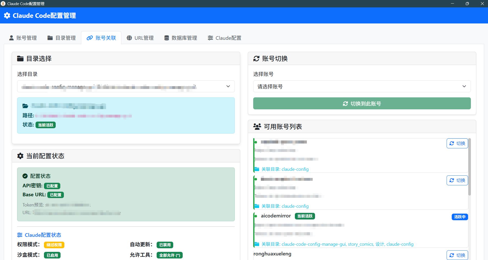
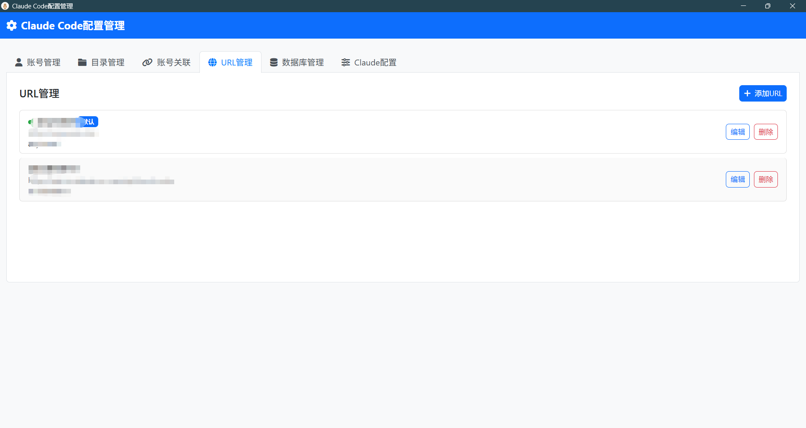
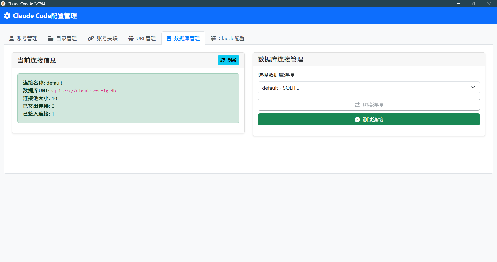
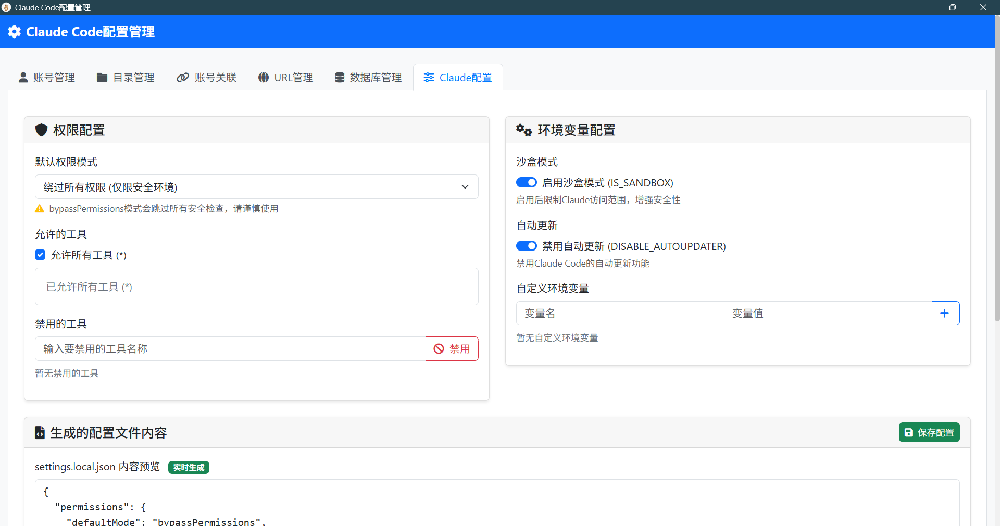

# Claude Code 配置管理器

🚀 一款基于 Tauri 框架构建的现代化 Claude Code 配置管理桌面应用程序，为开发者提供便捷的 Claude API 配置管理解决方案。

<div align="center">

<p><em>现代化的桌面应用界面，支持多账号管理和一键配置切换</em></p>
</div>

> **✨ 最新更新 (v1.1.0)**
> - 🔧 修复数据库初始化问题，确保应用稳定启动
> - 📁 数据库文件现在生成在 `resources` 目录，便于管理
> - 🧹 移除示例数据，提供干净的初始环境
> - 🌐 优化 API 端点配置，只保留必要的官方端点

## ✨ 核心功能

### 🔐 多账号管理
- **智能账号管理**: 创建、编辑、删除多个 Claude API 账号
- **账号状态追踪**: 实时显示账号活跃状态和关联情况
- **批量操作**: 支持批量管理和快速筛选
- **安全存储**: Token 等敏感信息安全加密存储

### 📁 项目目录管理
- **目录关联**: 管理项目目录与 Claude 配置的绑定关系
- **路径验证**: 自动检测目录存在性，智能处理无效路径
- **配置预览**: 实时查看目录当前的 Claude 配置状态
- **批处理**: 支持多目录统一管理

### ⚡ 一键配置切换
- **快速切换**: 在不同项目目录间一键切换 Claude 配置
- **智能关联**: 自动建立账号与目录的最佳匹配关系
- **配置同步**: 实时更新 `.claude/settings.local.json` 配置文件
- **沙盒模式**: 支持沙盒环境配置管理

### 🌐 API 端点管理
- **多端点支持**: 管理不同的 Claude API 端点 URL
- **预设模板**: 提供常用 API 端点的快速配置模板
- **默认配置**: 支持设置默认 API 端点
- **连接测试**: 内置 API 连接测试功能

### 🗄️ 数据库管理
- **多数据库支持**: SQLite 本地数据库和 MySQL 远程数据库
- **连接管理**: 灵活的数据库连接配置和切换
- **数据备份**: 自动数据备份和恢复功能
- **性能监控**: 实时显示数据库连接状态和性能指标

### 🛠️ Claude 高级配置
- **权限管理**: 精细化的 Claude 工具权限控制
- **环境变量**: 自定义环境变量配置管理
- **工具控制**: 灵活的 Claude 工具启用/禁用设置
- **配置预览**: JSON 格式的配置实时预览

## 🛠️ 技术架构

### 后端架构 (Rust)
- **🦀 Tauri 2.x**: 现代化跨平台桌面应用框架
- **⚡ SQLx 0.8**: 高性能异步 SQL 工具包，支持 SQLite 和 MySQL
- **🚀 Tokio**: 强大的异步运行时，确保高并发性能
- **📦 Serde**: 高效的序列化/反序列化库
- **⏰ Chrono**: 完整的日期时间处理解决方案
- **📝 Tracing**: 结构化日志记录和性能追踪
- **🔧 Anyhow**: 优雅的错误处理机制

### 前端技术 (Modern Web)
- **🎨 Bootstrap 5**: 响应式现代化 UI 框架
- **🎯 Font Awesome**: 丰富的图标库
- **⚡ 原生 JavaScript (ES6+)**: 高效的前后端通信
- **🎪 现代化组件**: 模态框、分页、搜索等交互组件

## 📁 项目结构

```
claude-code-config-manage-gui/
├── 📁 src/                           # 前端界面
│   ├── 📄 index.html                 # 主页面 - 现代化界面布局
│   ├── 🎨 styles.css                 # 样式文件 - 自定义主题和动画
│   └── ⚡ main.js                    # 核心逻辑 (2400+ 行)
│       ├── 🔐 账号管理功能
│       ├── 📁 目录管理功能  
│       ├── 🔄 配置切换功能
│       ├── 🌐 URL管理功能
│       ├── 🗄️ 数据库管理功能
│       └── 🛠️ Claude设置管理功能
├── 📁 src-tauri/                     # Rust 后端
│   ├── 📁 src/
│   │   ├── 🚀 main.rs               # 应用程序入口点
│   │   ├── 📚 lib.rs                # Tauri 命令集合和核心接口
│   │   ├── 📊 models.rs             # 数据模型定义
│   │   ├── 🗄️ database.rs           # 数据库操作层 (SQLite/MySQL)
│   │   ├── ⚙️ config_manager.rs     # Claude 配置文件管理
│   │   ├── 🛠️ claude_config.rs      # Claude 设置处理
│   │   ├── ⚙️ settings.rs           # 应用设置管理
│   │   ├── 💾 database_backup.rs    # 数据库备份功能
│   │   └── 📝 logger.rs             # 日志记录系统
│   ├── 📁 resources/                # 应用资源
│   │   ├── 📄 config.json           # 默认配置文件
│   │   ├── 🗄️ init_db.sql          # 数据库初始化脚本
│   │   └── 📁 config/               # 配置模板
│   ├── 🔧 Cargo.toml                # Rust 依赖和元信息
│   └── ⚙️ tauri.conf.json           # Tauri 应用程序配置
├── 🔧 package.json                   # Node.js 项目配置
├── 🔨 build.bat / build.sh          # 构建脚本 (Windows/Linux)
├── 🧹 cleanup.bat                   # 清理脚本
└── 📖 README.md                     # 项目文档
```

## 🚀 快速开始

### 📋 环境要求

| 组件 | 版本要求 | 安装说明 |
|------|---------|----------|
| 🦀 **Rust** | 1.70+ | [官方安装脚本](https://rustup.rs/) |
| 📦 **Node.js** | 18+ | [NVM 管理工具](https://github.com/nvm-sh/nvm) |
| 🔧 **Tauri CLI** | 2.x | `cargo install tauri-cli` |

#### 🐧 Linux 系统依赖

```bash
# Ubuntu/Debian
sudo apt update && sudo apt install -y \
    libwebkit2gtk-4.0-dev \
    build-essential \
    curl \
    wget \
    libssl-dev \
    libgtk-3-dev \
    libayatana-appindicator3-dev \
    librsvg2-dev

# Fedora/CentOS
sudo dnf install -y \
    webkit2gtk4.0-devel \
    openssl-devel \
    curl \
    wget \
    libappindicator-gtk3-devel \
    librsvg2-devel
```

#### 🪟 Windows 系统
- 安装 [Microsoft C++ Build Tools](https://visualstudio.microsoft.com/visual-cpp-build-tools/)
- 安装 [WebView2 Runtime](https://developer.microsoft.com/en-us/microsoft-edge/webview2/)

#### 🍎 macOS 系统
```bash
# 使用 Homebrew
xcode-select --install
```

### ⚡ 开发环境

```bash
# 1. 克隆仓库
git clone <repository-url>
cd claude-code-config-manage-gui

# 2. 安装前端依赖
npm install

# 3. 启动开发服务器 (支持热重载)
npm run tauri dev
```

### 🏗️ 生产构建

```bash
# 构建生产版本 (包含安装包)
npm run tauri build

# 构建输出位置:
# Windows: src-tauri/target/release/bundle/msi/
# Linux: src-tauri/target/release/bundle/deb/ 或 AppImage
# macOS: src-tauri/target/release/bundle/dmg/
```

### 🔧 自定义构建

```bash
# 仅构建可执行文件 (不打包)
cargo build --release --manifest-path src-tauri/Cargo.toml

# 使用中国镜像加速构建 (推荐)
./build.bat    # Windows
./build.sh     # Linux/macOS
```

## 🎯 首次使用指南

1. **启动应用**: 双击 `claude-config-manager.exe` 或从命令行运行
2. **自动初始化**: 应用会自动创建数据库文件和必要的目录结构
3. **添加账号**: 在"账号管理"页面添加您的 Claude API Token
4. **添加目录**: 在"目录管理"页面添加您的项目目录路径
5. **配置切换**: 在"配置切换"页面关联账号和目录，一键切换配置

> **💡 提示**: 首次启动时，应用会显示空白的账号和目录列表，这是正常的。您需要手动添加自己的配置数据。

## 📸 应用截图

### 🔐 账号管理
<div align="center">

<p><em>支持创建、编辑、删除多个 Claude API 账号，实时显示账号状态</em></p>
</div>

### 📁 目录管理
<div align="center">

<p><em>管理项目目录，支持路径验证和配置预览</em></p>
</div>

### ⚡ 账号关联与切换
<div align="center">

<p><em>一键切换不同项目的 Claude 配置，智能关联管理</em></p>
</div>

### 🌐 URL 管理
<div align="center">

<p><em>管理 API 端点，支持自定义 URL 和默认配置</em></p>
</div>

### 🗄️ 数据库管理
<div align="center">

<p><em>数据库连接状态监控，支持 SQLite 和 MySQL</em></p>
</div>

### 🛠️ Claude 高级配置
<div align="center">

<p><em>精细化的权限控制和环境变量配置</em></p>
</div>

## 💡 功能详解

### 🔐 账号管理系统

| 功能特性 | 详细说明 |
|----------|----------|
| **🆕 创建账号** | 支持添加 Claude API 密钥、自定义 Base URL、选择模型版本 |
| **✏️ 编辑账号** | 实时修改账号信息，支持批量更新操作 |
| **🗑️ 删除账号** | 安全删除确认机制，防止误操作 |
| **🔍 智能搜索** | 支持按账号名称、URL 筛选，实时搜索结果 |
| **📄 分页展示** | 大量账号数据的高效分页展示 |
| **🔗 关联状态** | 实时显示账号与项目目录的关联关系 |

### 📁 目录管理系统

| 功能特性 | 详细说明 |
|----------|----------|
| **📂 路径管理** | 智能目录选择，支持拖拽添加 |
| **✅ 路径验证** | 自动检测目录存在性，智能处理无效路径 |
| **👁️ 配置预览** | 实时查看目录的 Claude 配置状态 |
| **🏷️ 目录标记** | 显示活跃目录状态和关联情况 |
| **🔄 批量操作** | 支持多目录的批量管理和清理 |

### ⚡ 配置切换引擎

| 功能特性 | 详细说明 |
|----------|----------|
| **🎯 一键切换** | 快速在不同项目间切换 Claude 配置 |
| **🔄 智能同步** | 自动更新 `.claude/settings.local.json` |
| **🏖️ 沙盒模式** | 支持沙盒环境的独立配置管理 |
| **🔒 权限控制** | 可配置的文件写入权限检查 |
| **📈 切换历史** | 记录配置切换历史和状态 |

### 🌐 API 端点管理

| 功能特性 | 详细说明 |
|----------|----------|
| **🌍 多端点支持** | 管理官方和第三方 API 端点 |
| **⭐ 默认配置** | 设置常用端点为默认选项 |
| **🧪 连接测试** | 内置 API 连接状态测试 |
| **📝 描述标签** | 为每个端点添加描述和标签 |

## 🔧 API 接口文档

### 🔐 账号管理 API

| 命令 | 功能描述 | 参数 | 返回值 |
|------|----------|------|---------|
| `get_accounts` | 获取账号列表 | `page`, `per_page`, `search`, `base_url` | 分页账号数据 |
| `create_account` | 创建新账号 | `name`, `token`, `baseUrl`, `model` | 创建结果 |
| `update_account` | 更新账号信息 | `id`, `name`, `token`, `baseUrl`, `model` | 更新结果 |
| `delete_account` | 删除指定账号 | `id` | 删除结果 |
| `get_account_base_urls` | 获取账号使用的 URL | - | URL 列表 |

### 📁 目录管理 API

| 命令 | 功能描述 | 参数 | 返回值 |
|------|----------|------|---------|
| `get_directories` | 获取目录列表 | - | 目录列表 |
| `create_directory` | 创建新目录记录 | `path`, `name` | 创建结果 |
| `update_directory` | 更新目录信息 | `id`, `name`, `path` | 更新结果 |
| `delete_directory` | 删除目录记录 | `id` | 删除结果 |
| `check_directory_exists` | 检查目录是否存在 | `path` | 存在状态 |

### 🌐 URL 管理 API

| 命令 | 功能描述 | 参数 | 返回值 |
|------|----------|------|---------|
| `get_base_urls` | 获取 URL 列表 | - | URL 列表 |
| `create_base_url` | 创建新 URL | `name`, `url`, `description`, `is_default` | 创建结果 |
| `update_base_url` | 更新 URL 信息 | `id`, `name`, `url`, `description`, `is_default` | 更新结果 |
| `delete_base_url` | 删除 URL | `id` | 删除结果 |

### ⚡ 配置切换 API

| 命令 | 功能描述 | 参数 | 返回值 |
|------|----------|------|---------|
| `switch_account` | 切换账号配置 | `accountId`, `directoryId`, `isSandbox`, `skipPermissions` | 切换结果 |
| `switch_account_with_claude_settings` | 带 Claude 设置的切换 | `accountId`, `directoryId`, `isSandbox`, `claudeSettings` | 切换结果 |
| `get_current_config` | 获取目录当前配置 | `directoryId` | 配置信息 |
| `get_associations` | 获取关联关系 | - | 关联列表 |

### 🗄️ 数据库管理 API

| 命令 | 功能描述 | 参数 | 返回值 |
|------|----------|------|---------|
| `get_database_info` | 获取数据库信息 | - | 连接信息 |
| `get_database_connections` | 获取数据库连接列表 | - | 连接配置 |
| `switch_database` | 切换数据库连接 | `connectionName` | 切换结果 |
| `test_database` | 测试数据库连接 | `connectionName` | 测试结果 |

### 🛠️ Claude 设置 API

| 命令 | 功能描述 | 参数 | 返回值 |
|------|----------|------|---------|
| `get_claude_settings_from_db` | 获取 Claude 设置 | - | 设置数据 |
| `save_claude_settings_to_db` | 保存 Claude 设置 | `settingsJson` | 保存结果 |

## 📄 配置文件格式

### Claude 配置文件结构

应用会在项目目录下创建 `.claude/settings.local.json`：

```json
{
  "permissions": {
    "defaultMode": "bypassPermissions",
    "allow": ["*"],
    "deny": []
  },
  "env": {
    "ANTHROPIC_API_KEY": "sk-ant-xxx...",
    "ANTHROPIC_AUTH_TOKEN": "sk-ant-xxx...", 
    "ANTHROPIC_BASE_URL": "https://api.anthropic.com",
    "IS_SANDBOX": "1",
    "DISABLE_AUTOUPDATER": 1
  }
}
```

### 环境变量说明

| 变量名 | 作用 | 示例值 |
|--------|------|--------|
| `ANTHROPIC_API_KEY` | Claude API 密钥 | `sk-ant-xxx...` |
| `ANTHROPIC_AUTH_TOKEN` | 认证令牌 (同 API 密钥) | `sk-ant-xxx...` |
| `ANTHROPIC_BASE_URL` | API 基础地址 | `https://api.anthropic.com` |
| `IS_SANDBOX` | 沙盒模式 | `"1"` (启用) / `"0"` (禁用) |
| `DISABLE_AUTOUPDATER` | 禁用自动更新 | `1` (禁用) / `0` (启用) |

## 🗄️ 数据存储架构

### 数据库选择
- **SQLite** (默认): 本地文件数据库，无需额外配置
- **MySQL**: 支持远程数据库，适合团队共享

### 表结构设计

| 表名 | 用途 | 主要字段 |
|------|------|----------|
| **accounts** | 账号信息 | `id`, `name`, `token`, `base_url`, `model`, `is_active` |
| **directories** | 目录信息 | `id`, `name`, `path`, `is_active` |
| **base_urls** | API 端点 | `id`, `name`, `url`, `description`, `is_default` |
| **account_directories** | 关联关系 | `account_id`, `directory_id`, `created_at` |
| **claude_settings** | Claude 配置 | `id`, `settings_json`, `created_at` |

### 数据文件位置
```
📁 应用目录/
├── 📁 resources/               # 应用资源目录
│   ├── 🗄️ claude_config.db    # SQLite 数据库 (新位置)
│   ├── 📄 config.json         # 应用配置
│   └── 📁 config/             # 配置模板
├── 📁 logs/                   # 应用日志
│   ├── 📄 app.log            # 应用日志
│   └── 📄 error.log          # 错误日志
└── 🗄️ claude-config-manager.exe  # 应用程序
```

## 🚀 性能对比

### vs Python Flask 版本

| 指标 | Flask 版本 | Tauri 版本 | 提升 |
|------|------------|------------|------|
| **启动时间** | ~3s | ~0.5s | **6x** |
| **内存占用** | ~50MB | ~15MB | **3.3x** |
| **响应速度** | ~50ms | ~5ms | **10x** |
| **包大小** | ~200MB | ~8MB | **25x** |
| **CPU 占用** | 5-10% | 1-2% | **5x** |

### 功能完整性对比

| 功能模块 | Flask 版本 | Tauri 版本 | 状态 |
|----------|------------|------------|------|
| 🔐 账号管理 | ✅ | ✅ | **增强** |
| 📁 目录管理 | ✅ | ✅ | **增强** |
| ⚡ 配置切换 | ✅ | ✅ | **增强** |
| 🌐 URL 管理 | ✅ | ✅ | **新增** |
| 🗄️ 数据库管理 | ❌ | ✅ | **新增** |
| 🛠️ Claude 高级配置 | ❌ | ✅ | **新增** |
| 🎨 现代化界面 | ⚠️ | ✅ | **重构** |
| 📱 响应式设计 | ❌ | ✅ | **新增** |

## 🛠️ 故障排除

### 常见问题

<details>
<summary><b>🔧 构建问题</b></summary>

**问题**: 编译失败或依赖错误
```bash
# 1. 更新 Rust 工具链
rustup update

# 2. 清理缓存并重新安装依赖
rm -rf node_modules package-lock.json
cargo clean
npm install

# 3. 重新构建
npm run tauri build
```

**问题**: 应用启动时异常退出
- ✅ **已修复**: 数据库初始化失败导致的退出问题
- 应用现在会自动创建数据库文件，支持多重回退策略
- 数据库文件位置: `resources/claude_config.db`

**问题**: Linux 下缺少系统依赖
```bash
# Ubuntu/Debian
sudo apt install libwebkit2gtk-4.0-dev libayatana-appindicator3-dev

# Fedora/CentOS  
sudo dnf install webkit2gtk4.0-devel libappindicator-gtk3-devel
```
</details>

<details>
<summary><b>🗄️ 数据库问题</b></summary>

**问题**: 数据库连接失败
- 检查数据库文件权限
- 确保用户数据目录可写
- 查看应用日志获取详细错误信息

**问题**: MySQL 连接超时
- 检查网络连接
- 验证数据库服务器状态
- 确认连接字符串格式正确
</details>

<details>
<summary><b>📄 配置文件问题</b></summary>

**问题**: 配置文件写入失败
- 检查目标目录权限
- 确保 `.claude` 目录存在
- 验证磁盘空间充足

**问题**: 配置格式错误
- 验证 JSON 格式正确性
- 检查必需字段完整性
- 查看错误日志获取详细信息
</details>

## 👨‍💻 开发指南

### 🏗️ 项目架构

```
┌─────────────────┐    ┌─────────────────┐    ┌─────────────────┐
│   前端界面      │    │   Tauri 接口    │    │   Rust 后端     │
│                 │    │                 │    │                 │
│  • Bootstrap 5  │◄──►│  • 命令处理     │◄──►│  • 数据库操作   │
│  • JavaScript   │    │  • 事件管理     │    │  • 文件操作     │
│  • 组件化设计   │    │  • 错误处理     │    │  • 配置管理     │
└─────────────────┘    └─────────────────┘    └─────────────────┘
```

### 🔧 开发环境配置

```bash
# 1. 安装开发工具
cargo install tauri-cli
npm install -g @tauri-apps/cli

# 2. 启用开发模式
export RUST_LOG=debug
export TAURI_DEBUG=true

# 3. 热重载开发
npm run tauri dev
```

### 📝 添加新功能流程

#### 1️⃣ 数据模型定义 (`src-tauri/src/models.rs`)
```rust
#[derive(Debug, Serialize, Deserialize, sqlx::FromRow)]
pub struct NewFeature {
    pub id: i32,
    pub name: String,
    pub created_at: chrono::DateTime<chrono::Utc>,
}
```

#### 2️⃣ 数据库操作 (`src-tauri/src/database.rs`)
```rust
pub async fn create_feature(pool: &SqlitePool, name: &str) -> Result<NewFeature> {
    // 实现数据库操作逻辑
}
```

#### 3️⃣ Tauri 命令 (`src-tauri/src/lib.rs`)
```rust
#[tauri::command]
async fn create_feature(name: String, state: State<'_, AppState>) -> Result<NewFeature, String> {
    // 调用数据库操作
}
```

#### 4️⃣ 前端调用 (`src/main.js`)
```javascript
async function tauriCreateFeature(name) {
    return await invoke('create_feature', { name });
}
```

### 🧪 测试与调试

#### 后端调试
```rust
// 使用 tracing 进行结构化日志
use tracing::{info, warn, error};

#[tauri::command]
async fn debug_command() {
    info!("命令开始执行");
    // ... 业务逻辑
    warn!("发现潜在问题");
}
```

#### 前端调试
```javascript
// 开发模式下启用详细日志
if (window.__TAURI__.app.getName) {
    console.log('Tauri 环境已就绪');
}

// 错误处理最佳实践
try {
    const result = await tauriCommand();
    console.log('操作成功:', result);
} catch (error) {
    console.error('操作失败:', error);
    showError(`操作失败: ${getErrorMessage(error)}`);
}
```

### 🔍 代码质量

#### Rust 代码规范
```bash
# 格式化代码
cargo fmt

# 静态检查
cargo clippy

# 运行测试
cargo test
```

#### JavaScript 代码规范
- 使用 ES6+ 语法
- 遵循函数式编程原则
- 统一错误处理机制
- 模块化设计

### 📊 性能优化建议

1. **数据库查询优化**
   - 使用索引加速查询
   - 避免 N+1 查询问题
   - 合理使用连接池

2. **前端性能优化**
   - 延迟加载大量数据
   - 使用分页减少内存占用
   - 防抖搜索输入

3. **打包优化**
   - 移除未使用的依赖
   - 启用 LTO 优化
   - 压缩静态资源

## 📄 许可证

本项目采用 **MIT 许可证**，详见 [LICENSE](LICENSE) 文件。

## 🤝 贡献指南

### 如何贡献

1. **🍴 Fork 项目** 到你的 GitHub 账户
2. **🌿 创建功能分支** (`git checkout -b feature/amazing-feature`)
3. **💾 提交更改** (`git commit -m 'Add some amazing feature'`)
4. **📤 推送分支** (`git push origin feature/amazing-feature`)
5. **📋 创建 Pull Request**

### 贡献类型

- 🐛 **Bug 修复**: 修复现有问题
- ✨ **新功能**: 添加新的功能特性
- 📚 **文档**: 改进项目文档
- 🎨 **界面**: 优化用户界面和体验
- ⚡ **性能**: 提升应用性能
- 🧪 **测试**: 添加或改进测试用例

### 代码审查标准

- ✅ 代码符合项目规范
- ✅ 包含适当的错误处理
- ✅ 添加必要的注释和文档
- ✅ 通过所有现有测试
- ✅ 不破坏现有功能

## 💬 社区支持

- **🐛 Bug 报告**: [GitHub Issues](../../issues)
- **💡 功能建议**: [GitHub Discussions](../../discussions)
- **📧 邮件联系**: [项目维护者邮箱]
- **💬 即时交流**: [Discord/QQ 群]

---

<div align="center">
**⭐ 如果这个项目对你有帮助，请给我们一个 Star！**

[](../../)
[](https://www.rust-lang.org/)
[](https://tauri.app/)
